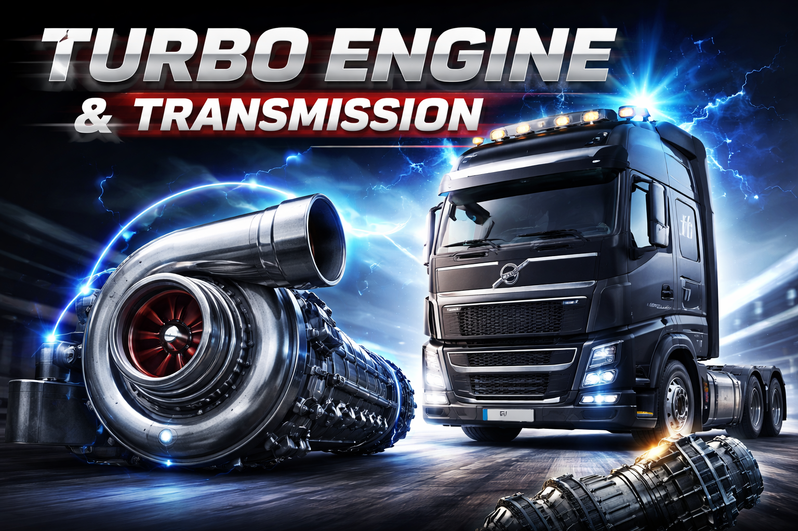

# Volvo FH6 Turbo Engine & Transmission



ETS2 mod that adds a turbo engine and transmission for the Volvo FH 2024.

Forked from [Turbo Engine & Transmission 1250HP All Trucks Dual Clutch](https://ets2.lt/en/turbo-engine-transmission-1250hp-all-trucks-dual-cluth-1-41-1-42-v0-10-1/).

- **Compatible versions:** ETS2 1.58.*

## Building the mod

Pack the `src/` folder contents into a `.scs` file (which is a ZIP archive):

```bash
cd src
zip -r ../volvo_fh6_turbo_engine.scs manifest.sii logo.jpg def/
```

## Installation

### Windows

Copy `volvo_fh6_turbo_engine.scs` to:

```
%USERPROFILE%\Documents\Euro Truck Simulator 2\mod\
```

### macOS

Copy `volvo_fh6_turbo_engine.scs` to:

```
~/Library/Application Support/Euro Truck Simulator 2/mod/
```

### Linux

Copy `volvo_fh6_turbo_engine.scs` to:

```
~/.local/share/Euro Truck Simulator 2/mod/
```

Then enable the mod in the ETS2 Mod Manager.
